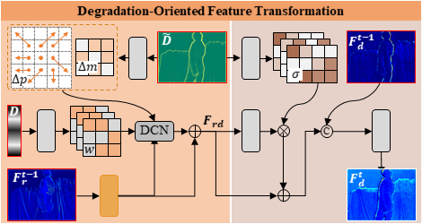
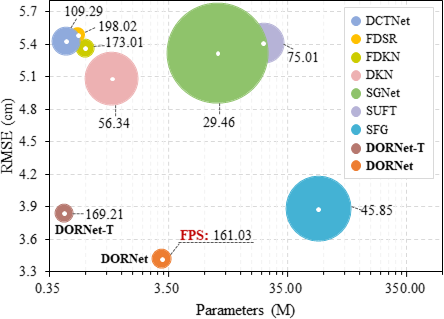

<p align="center">
<h2 align="center"> Degradation Oriented and Regularized Network for <br> Real-World Depth Super-Resolution </h2>


<center>Overview of DORNet. Given $\boldsymbol D_{up} $ as input, the degradation learning first encodes it to produce degradation representations $\boldsymbol {\tilde{D}}$  and $\boldsymbol D $. Then, $\boldsymbol {\tilde{D}}$,  $\boldsymbol D $, $\boldsymbol D_{lr} $, and $\boldsymbol I_{r} $ are fed into multiple degradation-oriented feature transformation (DOFT) modules, generating the HR depth $\boldsymbol D_{hr} $. Finally, $\boldsymbol D $ and $\boldsymbol D_{hr} $ are sent to the degradation regularization to obtain $\boldsymbol D_{d} $, which is used as input for the degradation loss $\mathcal{L} _{deg} $ and the contrastive loss $ \mathcal{L}_{cont} $. The degradation regularization only applies during training and adds no extra overhead in testing.</center>



<center>Degradation-Oriented Feature Transformation (DOFT)</center>


## Dependencies

```bash
Python==3.11.5
PyTorch==2.1.0
numpy==1.23.5 
torchvision==0.16.0
scipy==1.11.3
Pillow==10.0.1
tqdm==4.65.0
scikit-image==0.21.0
mmcv-full==1.7.2
```

## Datasets

[RGB-D-D](https://github.com/lingzhi96/RGB-D-D-Dataset)

## Models

Pretrained models can be found in  <a href="https://drive.google.com/drive/folders/1njJPTCmfe4YhLN-95awFrN2RhW5ThRdh?usp=sharing">checkpoints</a>

The model.py and the remaining pre-trained models will be released once the paper is accepted.

## Training

### DORNet

```
Train on real-world RGB-D-D
> python train.py
```

### DORNet-T

```
Train on real-world RGB-D-D
> python train.py --tiny_model
```

## Testing

### SPFNet

```
Test on real-world RGB-D-D
> python test.py
```

### SPFNet-T

```
Test on real-world RGB-D-D
> python test.py  --tiny_model
```

## Experiments

### Quantitative comparison

<p align="center">

</p>


### Visual comparison

<b>Train & test on real-world RGB-D-D: <b/>

<p align="center">

</p>

